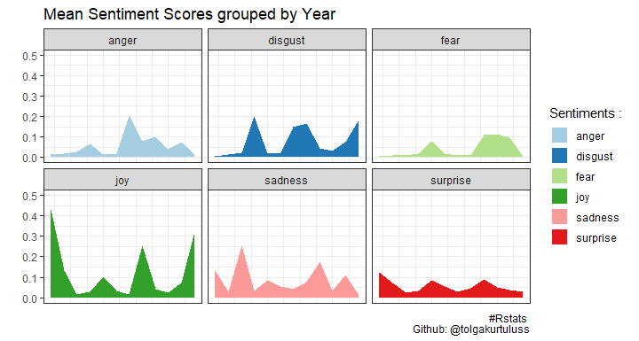

```{r, setup, echo = FALSE, message = FALSE}
library(readxl)
library(tidyverse)
library(lubridate)

knitr::opts_chunk$set(
  comment = "#>",
  tidy = FALSE,
  error = FALSE)

result <- read_excel("result.xlsx")

result = result %>% 
  gather(type,value, 4:10)

result2 = result %>% 
  filter(type != "neutral") %>% 
  mutate(year = year(date)) %>% 
  group_by(year,type) %>% 
  summarise(mean=mean(value))

```

## R version names 💻

R version names might be related with the sense of humor of whoever names the packages, but I wanted to discover how these names may be classified by the emotions. Dataset in this repo is firstly collected from [rversions](https://r-hub.github.io/rversions/) library on CRAN. Then emotions of the R version nicknames are classified with [Emotion English DistilRoBERTa-base](https://huggingface.co/j-hartmann/emotion-english-distilroberta-base) pre-trained model on Hugging Face🤗.

[](https://colab.research.google.com/github/j-hartmann/emotion-english-distilroberta-base/blob/main/simple_emotion_pipeline.ipynb)

## Emotion Classification with pre-trained model 🚀

Results of maximum values of each type of emotions regarding to the R-version nicknames and release dates:

```{r echo = FALSE, message = FALSE}
result %>% 
  group_by(type) %>% 
  filter(value == max(value)) %>% 
  as.data.frame()
```

As a result, R-version 3.5.0 that published in 2018-04-23 07:04:38 with the "Joy in Playing" nickname is the most joyful version name according to the model. 🎉

## Results 🌌

Sentiment Scores of R-version release names;


Plot of grouping mean sentiment scores by the release year;



Thank you!
