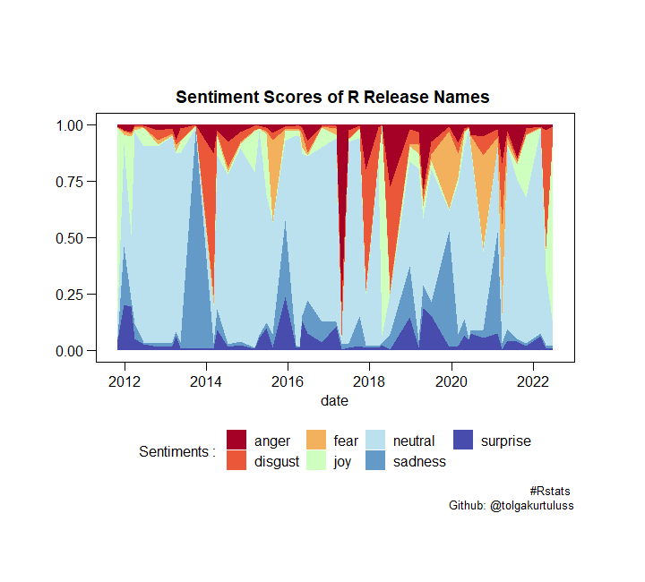
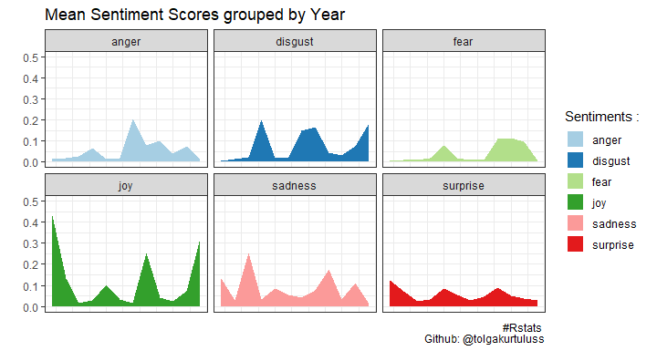

Emotion Classification R version nicknames
================

## R version names

Dataset in this repo is firstly collected from
[rversions](https://r-hub.github.io/rversions/) library on CRAN. Then
emotions of the R version nicknames are classified with [Emotion English
DistilRoBERTa-base](https://huggingface.co/j-hartmann/emotion-english-distilroberta-base)
pre-trained model on Hugging Face🤗.

## Emotion Classification with pre-trained model 🚀

Results of maximum values of each type of emotions regarding to the
R-version nicknames and release dates:

    #>   version                date                nickname     type     value
    #> 1   3.4.0 2017-04-21 07:14:45     You Stupid Darkness    anger 0.7864636
    #> 2   3.0.3 2014-03-06 08:12:33              Warm Puppy  disgust 0.6250166
    #> 3   4.0.3 2020-10-10 07:05:24 Bunny-Wunnies Freak Out     fear 0.4090978
    #> 4   3.5.0 2018-04-23 07:04:38          Joy in Playing      joy 0.9328308
    #> 5   4.0.1 2020-06-06 07:05:16          See Things Now  neutral 0.9292275
    #> 6   3.0.2 2013-09-25 07:11:09         Frisbee Sailing  sadness 0.9640978
    #> 7   3.2.3 2015-12-10 08:13:08   Wooden Christmas-Tree surprise 0.2383398

As a result, R-version 3.5.0 that published in 2018-04-23 07:04:38 with
the “Joy in Playing” nickname is the most joyful version name according
to the model. 🎉

## Results 🌌

Sentiment Scores of R-version release names;

Plot of grouping mean sentiment scores by the release year;

Thank you!
